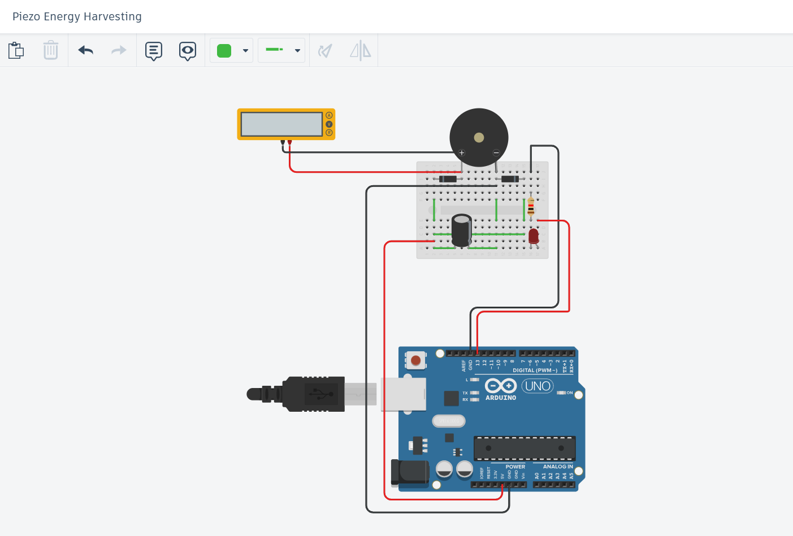

# 🌱 Piezoelectric Energy Harvesting using Arduino UNO

## 📌 Project Overview
This project demonstrates the **conversion of mechanical vibrations into usable electrical energy** using a **piezoelectric transducer** and **Arduino UNO**. The harvested energy is monitored via the Arduino and used to light an LED once a voltage threshold is crossed. This serves as a foundational model for self-powered IoT systems and vibration-sensing applications.

---

## 🧠 Objective
- To **harvest ambient mechanical energy** using a piezo disc.
- To **rectify and store the energy** using passive components.
- To **monitor and visualize** energy levels using Arduino.
- To **trigger an LED** when energy surpasses a defined threshold.

---

## 🔧 Components Used

| Component             | Quantity | Purpose                                      |
|----------------------|----------|----------------------------------------------|
| Arduino UNO          | 1        | Core microcontroller for sensing & control   |
| Piezoelectric Sensor | 1        | Energy generator from vibration or pressure  |
| 1N4148 Diodes        | 2        | Rectification and reverse polarity protection|
| Capacitor 1µF        | 1        | Voltage smoothing and energy storage         |
| LED (Red)            | 1        | Visual indicator of harvested energy         |
| Resistor 220Ω        | 1        | Current limiting resistor for LED            |
| Breadboard + Jumper Wires | —  | For circuit assembly                         |

---

## ⚙️ Circuit Diagram

  
> **Note:** This circuit consists of a piezo sensor feeding into a diode-capacitor rectifier, with the output connected to Arduino’s analog pin (A0) and LED on digital pin D7.

---

## 📈 Energy Harvesting Graph


### Interpretation:
- The **blue line** shows the piezo output voltage decaying over time.
- The **red dashed line** indicates the **LED threshold (2V)**.
- When the harvested voltage crosses 2V, the LED turns **ON**, indicating usable energy.

---

## 🧪 Working Principle

1. **Piezoelectric Effect**: Converts mechanical motion (taps, vibrations) into AC voltage.
2. **Rectification**: Diodes convert AC to pulsating DC.
3. **Smoothing**: Capacitor stores and smooths the voltage signal.
4. **Monitoring**: Arduino reads the analog voltage from capacitor.
5. **Decision Making**: If voltage > 2V, LED connected to D7 turns ON.

---

## 🧾 Arduino Code

```cpp
#define piezoPin A0
#define ledPin 7
int threshold = 410;  // ~2V on a 0–5V scale (0–1023)

void setup() {
  pinMode(ledPin, OUTPUT);
  Serial.begin(9600);
}

void loop() {
  int piezoValue = analogRead(piezoPin);
  Serial.println(piezoValue);

  if (piezoValue > threshold) {
    digitalWrite(ledPin, HIGH);
  } else {
    digitalWrite(ledPin, LOW);
  }

  delay(100);
}
```

### Applications
1. Footstep-based lighting or energy triggering systems.

2. Self-powered wireless sensor nodes.

3. Wearable devices that harvest motion energy.

4. Industrial vibration sensors.

### 🌐 Future Enhancements
1. Use supercapacitors or Li-ion cells for longer energy storage.

2. Add an IoT module (e.g., ESP8266/ESP32) for wireless energy event logging.

3. Extend with multiple piezos in parallel for greater energy yield.

4. Use a boost converter to increase voltage for useful loads.

### 📚 References
Arduino Documentation: https://www.arduino.cc/

Piezoelectric Sensors: https://en.wikipedia.org/wiki/Piezoelectric_sensor

Energy Harvesting Techniques: IEEE, Springer Journals

### 🧑‍🔬 Developed By
Manas Ranjan Das,
Department of Electrical & Computer Engineering
Ajay Binay Institute of Technology (ABIT), Cuttack
NIUS Research Intern @ HBCSE-TIFR | Member, ISTE | Robotics & IoT Enthusiast