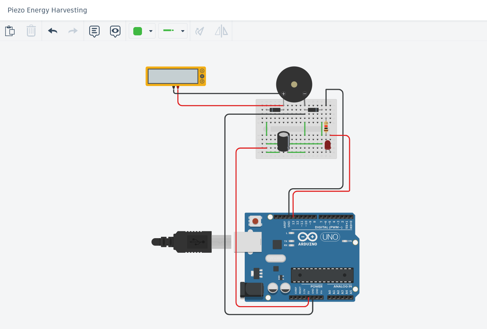
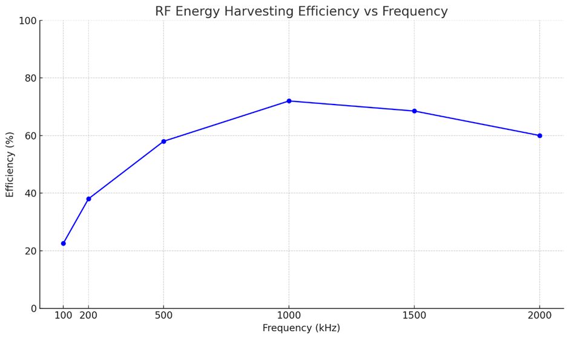

# 🌐 Hybrid Energy Harvesting Projects

This repository contains three distinct energy harvesting projects, each focusing on a unique energy source: **Piezoelectric**, **RF**, and **Solar**. These projects demonstrate innovative techniques for harvesting ambient energy and converting it into usable electrical power, with applications in IoT, renewable energy, and self-powered systems.

---

## 📂 Directory Structure
Hybrid_Energy_Harvesting  
├── Piezo_Energy_Harvest  
│ ├── Piezo-TinkerCad.png  
│ ├── Piezo-TinkerSchema.pdf  
│ ├── Piezo.md  
│ ├── PiezoGen.png  
├── RF_Energy_Harvest  
│ ├── RF-Efficiency.png  
│ ├── RF-TinkerCad.png  
│ ├── RF-TinkerSchema.pdf  
│ ├── RF.md  
├── Solar_Energy_Harvest  
│ ├── DutyCycle.png  
│ ├── SEH-TinkerCad.png  
│ ├── SEH-TinkerSchema.pdf  
│ ├── Solar.md  

---

## 📜 Project Summaries

### 1. [Piezoelectric Energy Harvesting](Piezo_Energy_Harvest/Piezo.md)
- **Objective**: Converts mechanical vibrations into electrical energy using a piezoelectric transducer.
- **Key Features**:
  - Energy rectification and storage using diodes and capacitors.
  - Voltage monitoring via Arduino UNO.
  - LED indicator for energy threshold crossing.
- **Applications**: Footstep-based lighting, vibration sensors, self-powered IoT devices.
- **Circuit Diagram**:  
  

---

### 2. [RF Energy Harvesting](RF_Energy_Harvest/RF.md)
- **Objective**: Harvests RF energy using a function generator as the RF source.
- **Key Features**:
  - Half-wave rectification using diodes.
  - Voltage scaling via a voltage divider for Arduino monitoring.
  - LED indicator for energy threshold crossing.
- **Applications**: Wireless sensor nodes, low-power IoT devices.
- **Efficiency Graph**:  
  

---

### 3. [Solar Energy Harvesting with Dual Axis Tracker](Solar_Energy_Harvest/Solar.md)
- **Objective**: Maximizes solar energy harvesting using a dual-axis solar tracker.
- **Key Features**:
  - Light sensing with LDRs for directional tracking.
  - Servo motors for panel adjustment.
  - Energy storage monitoring via a supercapacitor.
- **Applications**: Smart solar panels, renewable energy systems, IoT nodes.
- **Duty Cycle Analysis**:  
  

---

## 🛠️ Common Components

| Component             | Purpose                                      |
|-----------------------|----------------------------------------------|
| Arduino UNO/Nano      | Core microcontroller for sensing & control   |
| Diodes (1N4148)       | Rectification and reverse polarity protection|
| Capacitors            | Voltage smoothing and energy storage         |
| LEDs                  | Visual indicators of harvested energy        |
| Resistors             | Current limiting and voltage division        |
| Breadboard + Wires    | For circuit assembly                         |

---

## 🌟 Applications

1. **IoT Devices**: Self-powered wireless sensor nodes.
2. **Renewable Energy**: Efficient energy harvesting from ambient sources.
3. **Wearable Tech**: Motion-powered devices.
4. **Educational Tools**: Demonstrating energy harvesting principles.

---

## 🧑‍💻 Author

**Manas Ranjan Das**  
B.Tech ECE @ ABIT, Cuttack  
NIUS Physics Intern @ HBCSE-TIFR  
Researcher | Full-Stack Developer | IoT & Robotics Enthusiast

---

## 📜 License

This repository is open-source and available under the [MIT License](LICENSE).