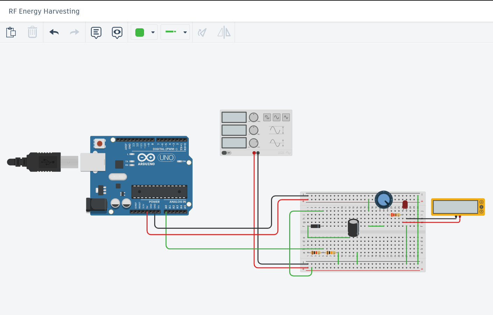

# RF Energy Harvesting Using Function Generator with Arduino

## Project Overview

This project demonstrates **RF energy harvesting** using a **function generator** as an RF source and an **Arduino UNO** to monitor the harvested energy. The energy is rectified and stored in a **capacitor**, and the voltage is then scaled down using a **voltage divider** to be read by the Arduino's **analog input pin**. An LED is used as an indicator for when the voltage exceeds a certain threshold.

### Key Components:
- **Function Generator**: Provides the RF signal (instead of an antenna).
- **1N4148 Diode**: Used for half-wave rectification of the RF signal.
- **Capacitor (1µF)**: Smooths the rectified signal to DC.
- **Voltage Divider (1kΩ + 1kΩ)**: Scales down the capacitor voltage to safe levels for the Arduino.
- **Arduino UNO**: Reads the voltage from the capacitor and controls the LED.
- **LED with Resistor (220Ω)**: Indicates the status of the harvested energy.

## Schematic Diagram

Below is the schematic for the circuit, where:
- The **function generator** supplies the RF input.
- The **1N4148 diode** rectifies the input signal.
- The **capacitor** smooths the DC voltage, which is then monitored by the Arduino through a **voltage divider**.


## Circuit Connections

| Sl. | From (Component)       | Pin/Terminal           | To (Component)       | Pin/Terminal         | Purpose                                 |
|-----|------------------------|------------------------|----------------------|----------------------|-----------------------------------------|
| 1   | Function Generator      | Output                | Diode (1N4148)       | Anode                | Start of rectifier                      |
| 2   | Diode (1N4148)         | Cathode               | Capacitor +ve        | Positive Terminal     | Half-wave rectification                 |
| 3   | Capacitor              | Negative Terminal     | Arduino GND          | GND                  | Common ground                           |
| 4   | Capacitor              | Positive Terminal     | Voltage Divider R1   | Top                  | Feeding into voltage divider            |
| 5   | Voltage Divider R1     | Bottom                | Arduino A0           | Analog Input         | Scaled voltage input to Arduino         |
| 6   | Voltage Divider R1     | Bottom                | Resistor R2          | Top                  | Continue voltage division               |
| 7   | Resistor R2            | Bottom                | Arduino GND          | GND                  | Ground reference                        |
| 8   | Arduino UNO            | 5V                    | Breadboard + rail    | +                    | Power for Arduino-side circuits         |
| 9   | Arduino UNO            | GND                   | Breadboard - rail    | -                    | Grounding everything                    |

## ⚙️ Circuit Diagram

 

## Efficiency Graph

The efficiency of the RF energy harvesting system was tested across a range of frequencies. The following graph shows the relationship between **RF signal frequency** and **efficiency**.

 

### Key Observations:
- Efficiency increases as the frequency rises, peaking around 1 MHz.
- The system operates at **optimal efficiency (~72%)** at 1 MHz.
- After 1 MHz, efficiency starts to slightly decline, possibly due to component losses or impedance mismatch.

## Code

The following Arduino code is used to monitor the voltage across the capacitor and control the LED based on the voltage level:

```cpp
const int analogPin = A0;  // Voltage sense pin
const int ledPin = 3;      // LED connected to D3

// Voltage divider values
const float R1 = 1000.0; // 1kΩ
const float R2 = 1000.0; // 1kΩ

const float Vref = 5.0;  // Arduino ADC reference

// Threshold to light LED (you can adjust as needed)
const float thresholdVoltage = 2.5;

void setup() {
  pinMode(ledPin, OUTPUT);
  Serial.begin(9600);
  Serial.println("RF Energy Monitor Initialized");
}

void loop() {
  int adcValue = analogRead(analogPin);
  float voltageAtA0 = (adcValue * Vref) / 1023.0;

  // Calculate original capacitor voltage
  float Vcap = voltageAtA0 * ((R1 + R2) / R2);

  // Debug prints
  Serial.print("ADC: "); Serial.print(adcValue);
  Serial.print(" | A0 Voltage: "); Serial.print(voltageAtA0, 3);
  Serial.print(" V | Vcap: "); Serial.print(Vcap, 3); Serial.println(" V");

  // LED control logic
  if (Vcap >= thresholdVoltage) {
    digitalWrite(ledPin, HIGH); // Turn LED ON
  } else {
    digitalWrite(ledPin, LOW);  // Turn LED OFF
  }

  delay(1000);
}
