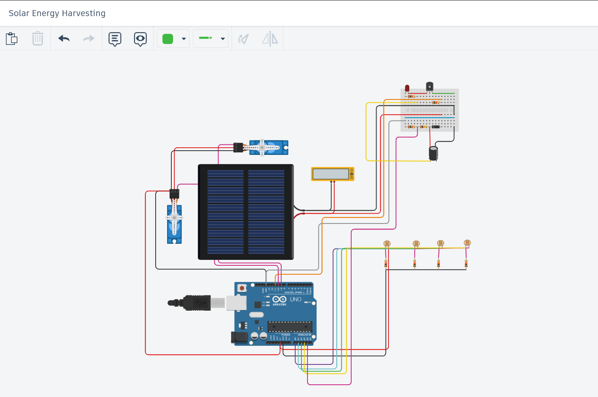
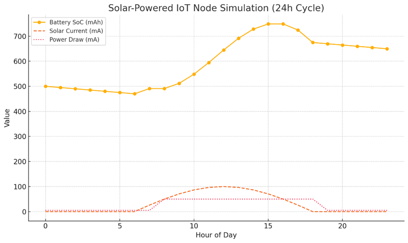

# 🌞 Dual Axis Solar Tracker with Energy Harvesting Storage

## 🧠 Project Overview

This project implements a **Dual Axis Solar Tracking System** powered by **energy harvested and stored in a capacitor**. It uses four Light Dependent Resistors (LDRs) to detect the direction of maximum sunlight and adjusts two servo motors to orient a solar panel accordingly for **maximum light exposure**. The system prioritizes **low-power operation**, using voltage monitoring of a storage capacitor to determine whether tracking actions can be safely executed.

---

## 🔋 Features

- ☀️ **Dual Axis Solar Tracking** using 4 LDRs (top-left, top-right, bottom-left, bottom-right).
- ⚙️ **2 Servo Motors** (Horizontal & Vertical) for panel adjustment.
- 🔋 **Energy Harvesting Support** via **supercapacitor storage** (low-power IoT mode).
- ⚠️ **Safe Tracking Enable/Disable** based on capacitor voltage threshold.
- 📈 Real-time **serial monitoring** of capacitor voltage.

---

## 🧩 Hardware Components

| Component         | Description                                     |
|------------------|-------------------------------------------------|
| Arduino UNO/Nano | Microcontroller board                           |
| 2x Servo Motors  | For dual-axis panel movement                    |
| 4x LDRs          | For directional light sensing                   |
| 4x 10kΩ Resistors | Pull-down resistors for LDR voltage divider     |
| Supercapacitor   | Energy storage element (e.g., 5.5V, 1F)         |
| Voltage Divider  | To safely measure capacitor voltage using A4    |
| Optional Relay / LED | To indicate or control power usage          |

---

## 🧠 Working Principle

1. **Energy Storage Monitoring**  
   - Capacitor voltage is read via analog pin A4 using a voltage divider.
   - If the voltage is above a certain threshold (e.g., 3.0V), tracking is enabled.
   - Otherwise, the system enters a power-saving mode and tracking is paused.

2. **Light Sensing**  
   - LDRs are placed at four corners of the panel.
   - The microcontroller computes light intensity differences between left-right and top-bottom.

3. **Servo Control**  
   - Based on the LDR difference, servo angles are adjusted to point toward the brightest region.
   - Servo motion is restricted within defined limits to prevent over-rotation.

4. **Load Management**  
   - A load pin (optional) is turned ON/OFF based on capacitor voltage to demonstrate or control energy usage.

---

## 🔧 Pin Configuration

| Arduino Pin | Connected To             |
|-------------|--------------------------|
| A0          | LDR Top Left             |
| A1          | LDR Bottom Left          |
| A2          | LDR Bottom Right         |
| A3          | LDR Top Right            |
| A4          | Capacitor Voltage Divider|
| 9           | Servo (Horizontal Axis)  |
| 10          | Servo (Vertical Axis)    |
| 11          | Optional LED / Relay     |

## ⚙️ Circuit Diagram

 

---

## 📦 How to Use

1. Connect all components as per the pin configuration.
2. Upload the Arduino code provided in `solar_tracker.ino`.
3. Open the Serial Monitor at 9600 baud to observe capacitor voltage.
4. Observe how the tracker moves only when sufficient energy is available.

---

## 24 hrs Analysis
 


## Code
``` cpp
#include <Servo.h>  // Include Servo library to control servo motors

// ──────────────────────────────────────
// Servo Setup
Servo horizontal;  // Horizontal servo motor
Servo vertical;    // Vertical servo motor

int servoh = 180;             // Initial horizontal servo angle
int servohLimitHigh = 175;    // Maximum horizontal servo limit
int servohLimitLow = 5;       // Minimum horizontal servo limit

int servov = 45;              // Initial vertical servo angle
int servovLimitHigh = 100;    // Maximum vertical servo limit
int servovLimitLow = 1;       // Minimum vertical servo limit

// ──────────────────────────────────────
// LDR (Light Dependent Resistor) Pin Setup
int ldrlt = A0;  // Top-left LDR
int ldrld = A1;  // Bottom-left LDR
int ldrrd = A2;  // Bottom-right LDR
int ldrrt = A3;  // Top-right LDR

// ──────────────────────────────────────
// Energy Harvesting Storage (Capacitor)
int storagePin = A4;         // Analog pin connected to capacitor voltage divider
int ledControlPin = 11;      // Digital pin to control an optional load (LED or relay)
float storageVoltage = 0.0;  // Variable to store calculated capacitor voltage

void setup() {
  Serial.begin(9600);  // Start serial communication at 9600 baud rate

  // Attach servos to PWM pins
  horizontal.attach(9);   // Horizontal servo on pin 9
  vertical.attach(10);    // Vertical servo on pin 10

  // Set servos to initial positions
  horizontal.write(servoh);
  vertical.write(servov);

  // Setup the load control pin
  pinMode(ledControlPin, OUTPUT);
  digitalWrite(ledControlPin, LOW);  // Turn OFF the load initially

  delay(2500); // Delay to allow capacitor to charge up at power-on
}

void loop() {
  // ──────────────────────────────────────
  // 1. Monitor Storage Capacitor Voltage
  int analogValue = analogRead(storagePin); // Read voltage divider analog value
  float voltage = analogValue * (5.0 / 1023.0); // Convert ADC reading to actual voltage at divider
  storageVoltage = voltage * 11; // Adjust using voltage divider ratio (e.g., R1=10k, R2=1k)

  // Print storage voltage to serial monitor
  Serial.print("Storage Capacitor Voltage: ");
  Serial.println(storageVoltage);

  float voltageThreshold = 3.0; // Minimum voltage required to power servos and control logic

  // ──────────────────────────────────────
  // 2. Load Control Logic (if used)
  if (storageVoltage > voltageThreshold) {
    digitalWrite(ledControlPin, HIGH);  // Enable load if voltage is sufficient
  } else {
    digitalWrite(ledControlPin, LOW);   // Disable load to conserve energy
  }

  // ──────────────────────────────────────
  // 3. Solar Tracking Control Logic
  if (storageVoltage > voltageThreshold) {
    // Read LDR values from all four directions
    int lt = analogRead(ldrlt); // Top-left
    int rt = analogRead(ldrrt); // Top-right
    int ld = analogRead(ldrld); // Bottom-left
    int rd = analogRead(ldrrd); // Bottom-right

    int dtime = 10; // Delay between each adjustment step
    int tol = 90;   // Tolerance threshold to reduce servo jitter

    // Calculate average light intensity in each direction
    int avt = (lt + rt) / 2; // Top side average
    int avd = (ld + rd) / 2; // Bottom side average
    int avl = (lt + ld) / 2; // Left side average
    int avr = (rt + rd) / 2; // Right side average

    // Calculate differences for movement decisions
    int dvert = avt - avd;   // Vertical difference
    int dhoriz = avl - avr;  // Horizontal difference

    // ──────────────────────────────────────
    // Adjust Vertical Servo Based on Light Difference
    if (abs(dvert) > tol) {
      if (avt > avd) {
        servov++;  // Move up
        if (servov > servovLimitHigh) servov = servovLimitHigh;  // Clamp max value
      } else {
        servov--;  // Move down
        if (servov < servovLimitLow) servov = servovLimitLow;    // Clamp min value
      }
      vertical.write(servov); // Send angle to vertical servo
    }

    // ──────────────────────────────────────
    // Adjust Horizontal Servo Based on Light Difference
    if (abs(dhoriz) > tol) {
      if (avl > avr) {
        servoh--;  // Move left
        if (servoh < servohLimitLow) servoh = servohLimitLow;
      } else {
        servoh++;  // Move right
        if (servoh > servohLimitHigh) servoh = servohLimitHigh;
      }
      horizontal.write(servoh); // Send angle to horizontal servo
    }

    delay(dtime); // Small delay between tracking actions
  } else {
    // If capacitor voltage is low, disable servo movement
    horizontal.write(servoh);  // Hold last position (or move to rest position if needed)
    vertical.write(servov);
    Serial.println("⚠️ Capacitor voltage low - tracking paused.");
  }

  delay(500); // Delay before next loop iteration to avoid excessive servo jitter
}

```


---

## 🧪 Calibration Tips

- Adjust `voltageThreshold` based on the minimum required for safe operation.
- Use precise resistors (e.g., 10kΩ & 1kΩ) for accurate voltage divider scaling.
- Tune `tol` (tolerance) to reduce servo jitter in low sunlight.

---

## 🧠 Possible Improvements

- Add **MPPT (Maximum Power Point Tracking)** for optimized power harvesting.
- Integrate with **IoT platform** to log voltage and tracking behavior.
- Replace servos with **stepper motors** for finer control.
- Power via **solar cell + capacitor hybrid** for full off-grid operation.

---

## 📸 Example Use Cases

- Smart Solar Panels for IoT Nodes
- DIY Renewable Energy Projects
- Environmental Research Tools
- Educational Demonstrators

---

## 🧑‍💻 Author

**Manas Ranjan Das**  
B.Tech ECE @ ABIT, Cuttack  
NIUS Physics Intern @ HBCSE-TIFR  
Researcher | Full-Stack Developer | IoT & Robotics Enthusiast

---

## 📜 License

This project is open-source and available under the [MIT License](LICENSE).

