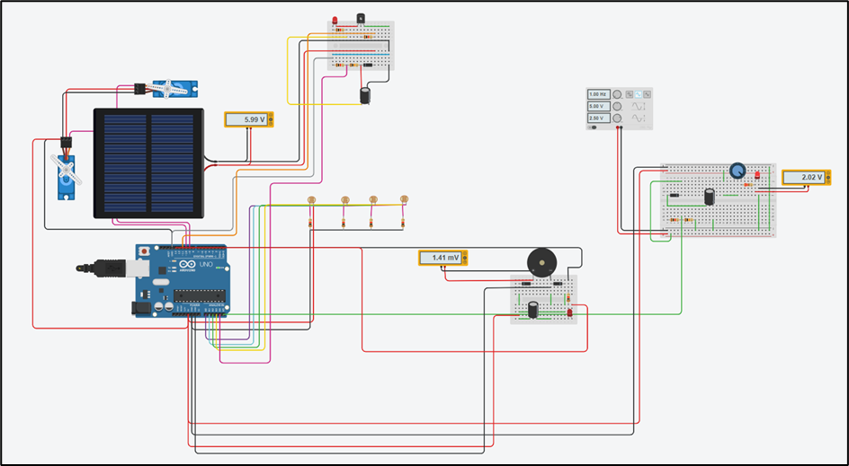

# 🌞📡⚡ Hybrid Energy Harvesting System using Arduino Uno

This project demonstrates a **3-stage energy harvesting** system using **Solar**, **RF**, and **Piezoelectric** sources to charge capacitors and monitor power levels in real time. It integrates a **solar tracker** that follows the sun using LDR sensors and servo motors, and enables a load (e.g., an LED) only when a safe storage voltage is achieved. The system is ideal for **self-sustainable IoT sensor nodes** and **green electronics**.

---

## 🔧 Hardware Requirements

### 🧠 Microcontroller:
- Arduino Uno (or compatible)

### ☀️ Solar Tracking Stage:
- 4x LDRs (Light Dependent Resistors)
- 2x Servo motors (for horizontal and vertical axis)
- Solar panel
- Capacitor for energy storage (470μF–1000μF recommended)
- Voltage divider (resistors, e.g., 10kΩ and 1kΩ)
- Optional relay or high-power MOSFET for load control
- LED/Load

### 📡 RF Energy Harvesting Stage:
- RF Energy Harvester (e.g., using an antenna or commercial RF harvesting module)
- Capacitor for RF energy storage
- Voltage divider (2x 1kΩ resistors recommended)
- LED or indicator load

### ⚡ Piezo Energy Harvesting Stage:
- Piezoelectric element (from lighter, buzzer, or piezo disc)
- Capacitor to smooth output (10μF–100μF)
- LED or small load

---

## 🔌 Pin Configuration

| Component         | Arduino Pin |
|------------------|-------------|
| Servo Horizontal | D9          |
| Servo Vertical   | D10         |
| LDR Top Left     | A0          |
| LDR Down Left    | A1          |
| LDR Down Right   | A2          |
| LDR Top Right    | A3          |
| Capacitor Voltage (Solar) | A4 |
| Load LED (Solar) | D11         |
| RF Voltage Sensing | A5       |
| Load LED (RF)     | D3          |
| Piezo Input       | A6          |
| Load LED (Piezo)  | D13         |

> ⚠️ Ensure analog pins A4–A6 are not used for I2C or Serial when overlapping with peripherals.

## ⚙️ Circuit Diagram

 
---

## 🧠 Software Features

### 1. **Capacitor Voltage Monitoring**
- Reads voltage across capacitors using voltage dividers.
- Calculates real voltage using `V = Vread × (R1 + R2)/R2`.
- Enables/disables load based on threshold voltage.

### 2. **Solar Tracker**
- Reads LDR values to calculate light intensity from four quadrants.
- Adjusts servo motors for **maximum light incidence**.
- Activates tracking only when capacitor voltage is above threshold.

### 3. **RF Energy Harvesting**
- Monitors the RF harvester’s capacitor voltage.
- Lights an LED if sufficient energy is available.

### 4. **Piezo Energy Harvesting**
- Measures piezo voltage in real-time.
- Activates a load if vibration/pressure exceeds threshold.

---

## 📈 Voltage Calibration (Important)
Adjust these based on your **voltage divider resistors**:

```cpp
float voltage = analogValue * (5.0 / 1023.0);
storageVoltage = voltage * DIVIDER_SCALING_FACTOR;

```
## Code:
``` cpp
#include <Servo.h>

// ─────────────────────────────────────────────
// Servo Setup for Solar Tracker
Servo horizontal;
Servo vertical;

int servoh = 180;
int servohLimitHigh = 175;
int servohLimitLow = 5;

int servov = 45;
int servovLimitHigh = 100;
int servovLimitLow = 1;

// ─────────────────────────────────────────────
// LDR Pins (Solar Tracker)
int ldrlt = A0; // Top Left
int ldrld = A1; // Down Left
int ldrrd = A2; // Down Right
int ldrrt = A3; // Top Right

// ─────────────────────────────────────────────
// Solar Energy Storage (Capacitor)
int solarStoragePin = A4;      // Capacitor voltage read pin
int solarLedPin = 11;          // Load control or LED
float solarVoltage = 0.0;

// ─────────────────────────────────────────────
// RF Energy Harvesting
const int rfAnalogPin = A5;    // RF voltage sensing pin
const int rfLedPin = 6;        // RF load/indicator
const float rfR1 = 1000.0;
const float rfR2 = 1000.0;
const float rfThreshold = 2.5;

// ─────────────────────────────────────────────
// Piezoelectric Harvesting
const int piezoPin = A6;       // Piezo output analog pin
const int piezoLedPin = 13;    // Piezo indicator
const float piezoThreshold = 2.0;

// ─────────────────────────────────────────────
void setup() {
  Serial.begin(9600);

  // Solar Tracker Setup
  horizontal.attach(9);
  vertical.attach(10);
  horizontal.write(servoh);
  vertical.write(servov);

  pinMode(solarLedPin, OUTPUT);
  pinMode(rfLedPin, OUTPUT);
  pinMode(piezoLedPin, OUTPUT);

  digitalWrite(solarLedPin, LOW);
  digitalWrite(rfLedPin, LOW);
  digitalWrite(piezoLedPin, LOW);

  delay(2500); // Allow capacitor to initially charge
}

void loop() {
  // ─────────────────────────────────────────────
  // 1. Solar Capacitor Monitoring
  int solarADC = analogRead(solarStoragePin);
  float vSolarDivider = solarADC * (5.0 / 1023.0);
  solarVoltage = vSolarDivider * 11;  // Adjust for actual divider

  Serial.print("🔆 Solar Capacitor Voltage: ");
  Serial.print(solarVoltage); Serial.println(" V");

  float solarThreshold = 3.0;
  if (solarVoltage > solarThreshold) {
    digitalWrite(solarLedPin, HIGH);
  } else {
    digitalWrite(solarLedPin, LOW);
  }

  // ─────────────────────────────────────────────
  // 2. RF Energy Monitoring
  int rfADC = analogRead(rfAnalogPin);
  float vRF = (rfADC * 5.0) / 1023.0;
  float vRFcap = vRF * ((rfR1 + rfR2) / rfR2);

  Serial.print("📡 RF Voltage: ");
  Serial.print(vRFcap); Serial.println(" V");

  if (vRFcap >= rfThreshold) {
    digitalWrite(rfLedPin, HIGH);
  } else {
    digitalWrite(rfLedPin, LOW);
  }

  // ─────────────────────────────────────────────
  // 3. Piezo Voltage Monitoring
  int piezoADC = analogRead(piezoPin);
  float piezoVoltage = (piezoADC * 5.0) / 1023.0;

  Serial.print("⚙️ Piezo Voltage: ");
  Serial.print(piezoVoltage); Serial.println(" V");

  if (piezoVoltage > piezoThreshold) {
    digitalWrite(piezoLedPin, HIGH);
  } else {
    digitalWrite(piezoLedPin, LOW);
  }

  // ─────────────────────────────────────────────
  // 4. Solar Tracking (Only if Solar Voltage is Sufficient)
  if (solarVoltage > solarThreshold) {
    int lt = analogRead(ldrlt);
    int rt = analogRead(ldrrt);
    int ld = analogRead(ldrld);
    int rd = analogRead(ldrrd);

    int dtime = 10;
    int tol = 90;

    int avt = (lt + rt) / 2;
    int avd = (ld + rd) / 2;
    int avl = (lt + ld) / 2;
    int avr = (rt + rd) / 2;

    int dvert = avt - avd;
    int dhoriz = avl - avr;

    if (abs(dvert) > tol) {
      if (avt > avd) {
        servov++;
        if (servov > servovLimitHigh) servov = servovLimitHigh;
      } else {
        servov--;
        if (servov < servovLimitLow) servov = servovLimitLow;
      }
      vertical.write(servov);
    }

    if (abs(dhoriz) > tol) {
      if (avl > avr) {
        servoh--;
        if (servoh < servohLimitLow) servoh = servohLimitLow;
      } else {
        servoh++;
        if (servoh > servohLimitHigh) servoh = servohLimitHigh;
      }
      horizontal.write(servoh);
    }

    delay(dtime);
  } else {
    Serial.println("⚠️ Solar voltage low - tracking paused.");
    horizontal.write(servoh);
    vertical.write(servov);
  }

  Serial.println("---------------------------------------------");
  delay(1000);
}

```


- Solar: Scaling factor ≈ 11 (if 10kΩ & 1kΩ used)

- RF: 2:1 ratio (1kΩ + 1kΩ)

- Piezo: Direct read (assume unscaled if single stage)

## 📊 Serial Output Preview
- Storage Capacitor Voltage: 3.25V
- ⚡ RF Energy: 2.91V | Threshold reached - LED ON
- ⚡ Piezo Voltage: 2.4V - LED ON
- Sunlight Detected - Tracking Active
- Servo Position: H=170, V=47

## 📌 Future Improvements
1. Add data logging with SD card module.
2. Connect to IoT cloud (Blynk/ThingSpeak) to monitor energy trends.
3. Boost converter for usable DC output from capacitors.
4. Integrate all three power paths to a supercapacitor or battery.

## 📘 Applications
1. Smart urban sensors
2. Off-grid data loggers
3. Wearable tech with vibration harvesting
4. Low-power IoT nodes in remote environments

## 👨‍🔧 Developed By
Manas Ranjan Das
Dept. of Electrical & Computer Engineering
Ajay Binay Institute of Technology (ABIT), Cuttack
Biju Pattanaik University of Technology (BPUT)

## 📜 License
This project is open-source and free to use for educational and research purposes.


---


